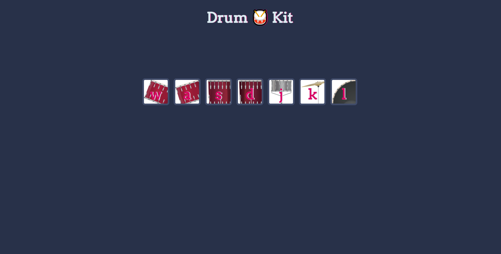

...

#  Drum-Kit Website / Bootstrap / App Brewery - Angela Yu Project

...

# A fully responsive drum kit EXAMPLE project written in HTML-CSS-JS (DOM) showing a website.

* This project is an example that was built along with a Udemy course (Angela Yu - App Brewery) showing how to create a responsive website in HTML-CSS-JS. Every part of this project is sample code.

* In this project, the user receives various audio feedbacks by clicks or pressing the buttons.

* Bu proje Angela Yu - AppBrewery tarafından hazırlanan hızlı yanıt verebilen bir HTML-CSS-JS websitesinin örnek yapımını göstermektedir. Projenin her bir parçası örnek koddur.

* Bu projede kullanıcı görünen butonlara basarak ve ya tıklayarak görsellerde görünen enstrümanlardan sesli geri dönüşler almaktadır.

## Take a look at the website ! - Websiteye bir göz atın !

